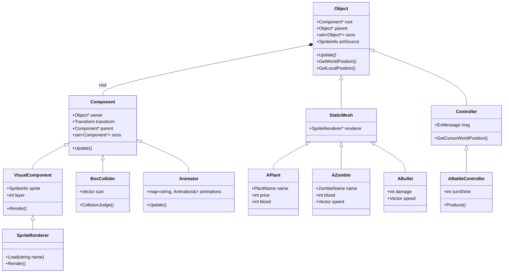

```
- `PlantVsZombie2/`
  - `PlantVsZombie2.vcxproj.filters`
  - `PlantVsZombie2.rc`
  - `engine/20210922203508615-1种尺寸.ico`
  - Engine
    - Components
      - `Animation.h`
      - `Animation.cpp`
      - `Camera.h`
      - `Camera.cpp`
      - `Renderer.h`
      - `Renderer.cpp`
      - `Audio.h`
      - `Audio.cpp`
      - `BoxCollider.h`
      - `BoxCollider.cpp`
      - `Particle.h`
      - `Particle.cpp`
      - `Timer.h`
      - `RigidBody.h`
    - Objects
      - `Controller.h`
      - `Controller.cpp`
      - `UserInterface.h`
      - `UserInterface.cpp`
      - `GameInstance.h`
      - `GameInstance.cpp`
    - (Engine 根)
      - `CoreMinimal.h`
      - `CoreMinimal.cpp`
      - `GameStatics.h`
      - `Overall.h`
      - `Resources.h`
      - `Resources.cpp`
      - `MultiThreadMediaPlayer.h`
      - `MultiThreadMediaPlayer.cpp`
      - `game.cpp`
  - Project
    - 头文件
      - Base
        - `BasePlant.h`
        - `BaseZombie.h`
        - `BaseBullet.h`
      - Plant
        - `PeaShooter.h`
        - `SunFlower.h`
        - `DoubleShooter.h`
        - `WallNut.h`
        - `CherryBomb.h`
        - `Mine.h`
        - `IceShooter.h`
        - `Chomper.h`
      - Bullet
        - `Pea.h`
        - `Sun.h`
        - `IcePea.h`
      - Zombie
        - `NormalZombie.h`
        - `BucketZombie.h`
        - `JumpZombie.h`
        - `HatZombie.h`
        - `ArmorZombie.h`
        - `BossZombie.h`
        - `NormalStand.h`
        - `HatStand.h`
        - `FlagZombie.h`
      - Effect
        - `Grow.h`
        - `Boom.h`
        - `Bomb.h`
        - `PeaPieces.h`
        - `IcePieces.h`
        - `Split.h`
        - `NutPieces.h`
      - Controller
        - `BattleController.h`
        - `MenuController.h`
      - Stuff
        - `ZombieHand.h`
        - `Head.h`
        - `Roll.h`
        - `Car.h`
        - `Hat.h`
        - `Bucket.h`
      - UI
        - `BattleUI.h`
        - `MenuUI.h`
      - 其他
        - `resource.h`
    - 源文件
      - Base
        - `BasePlant.cpp`
        - `BaseBullet.cpp`
        - `BaseZombie.cpp`
      - Plant
        - `PeaShooter.cpp`
        - `SunFlower.cpp`
        - `DoubleShooter.cpp`
        - `WallNut.cpp`
        - `CherryBomb.cpp`
        - `Mine.cpp`
        - `IceShooter.cpp`
        - `Chomper.cpp`
      - Bullet
        - `Pea.cpp`
        - `Sun.cpp`
        - `IcePea.cpp`
      - Zombie
        - `NormalZombie.cpp`
        - `BucketZombie.cpp`
        - `JumpZombie.cpp`
        - `HatZombie.cpp`
        - `ArmorZombie.cpp`
        - `BossZombie.cpp`
        - `FlagZombie.cpp`
      - Effect
        - (多数 Effect 文件为头文件)
      - Controller
        - `BattleController.cpp`
        - `MenuController.cpp`
      - Stuff
        - `Car.cpp`
      - UI
        - `BattleUI.cpp`
        - `MenuUI.cpp`
```

## 原项目类图



